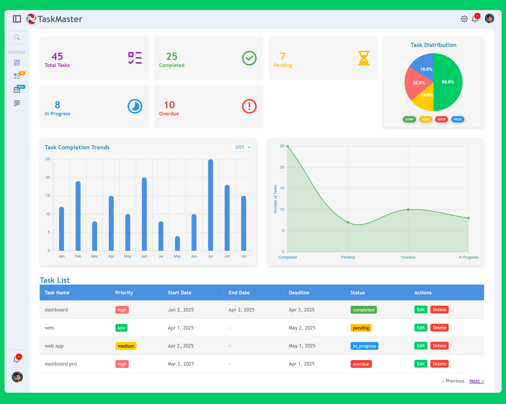

# Task Management System

## Introduction
The Task Management System is a Laravel-based application that allows users to manage their tasks efficiently. It includes authentication via Google, task creation, editing, and deletion features, with AJAX for seamless user interactions.

## Features
- User authentication (Login & Registration)
- Google authentication
- Task creation, editing, updating, and deletion
- Task validation using form requests
- Custom error pages
- Organized Blade components for reusability
- **AJAX Integration** for seamless task operations
- **UUID-based user identification** for better security and scalability
- **Task priority management** (low, medium, high)
- **Task status tracking** (pending, in progress, completed)
- **Automatic deadline checking** to identify overdue tasks

## Installation

### Prerequisites
Ensure you have the following installed:
- PHP (>= 8.0)
- Composer
- Laravel
- MySQL

### Setup Steps
1. Clone the repository:
   ```bash
   git clone https://github.com/berhan5378/TaskManagement 
   ```
2. Install dependencies:
   ```bash
   composer install
   ```
3. Create the environment file:
   ```bash
   cp .env.example .env
   ```
4. Generate application key:
   ```bash
   php artisan key:generate
   ```
5. Set up the database in `.env` and run migrations:
   ```bash
   php artisan migrate
   ```
6. Start the application:
   ```bash
   php artisan serve
   ```

## File Structure

### Controllers
- `Auth\GoogleController.php` - Handles Google authentication.
- `Auth\AuthController.php` - Manages login and registration.
- `TaskController.php` - Handles CRUD operations for tasks.

### Models
- `Task.php` - Represents the task entity, including task priority, deadline handling, and user relationships.
- `User.php` - Represents the user entity, using UUID for unique identification.

### Views
- `resources/views/auth/` - Authentication views (login, register).
- `resources/views/components/auth/` - Authentication layout.
- `resources/views/components/errors/` - Custom error pages.
- `resources/views/components/task-management/` - Task management UI components.
- `resources/views/taskManagement/` - Task CRUD views (create, edit, index).
- `resources/views/layout.blade.php` - Main layout file.

### Public Assets
- `public/assets/css/` - Stylesheets.
- `public/assets/img/` - Images.
- `public/assets/js/` - JavaScript files.

### Routes
- `routes/web.php` - Defines all web routes.

## AJAX Integration
AJAX is used to enhance the user experience by making asynchronous requests without requiring a full page reload. It is implemented for:
- Creating tasks
- Updating tasks
- Deleting tasks
- Fetching task details dynamically

## Usage
- Register or login via Google.
- Create, edit, or delete tasks.
- View a list of tasks and their details.
- Perform **AJAX-based operations** for a smoother experience.
- Track overdue tasks automatically.

## Project Preview

